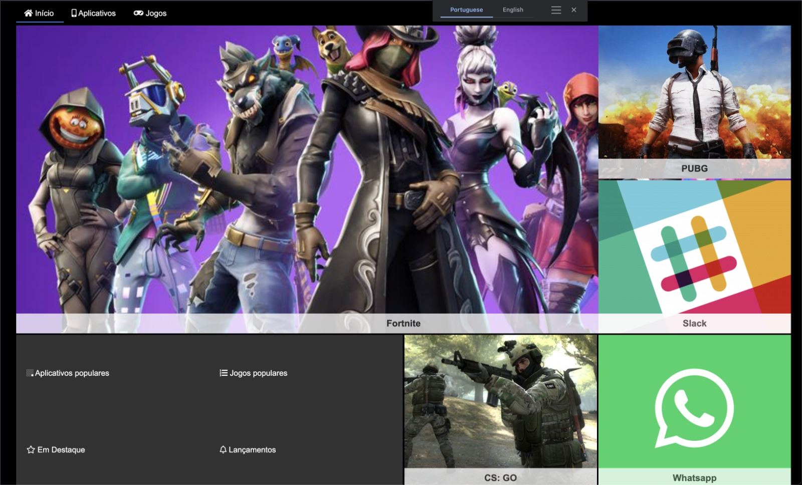

# < store-x >

<fig>

<figcaption>The store website home page</figcaption>
</fig>

# < store-x >

## introduction

> This project
> was developed with the idea of an online game store in mind, similar to the Xbox platform, for instance.

The goal was to reimagine and enhance the user experience, catering to the gaming community's preferences and desires.

## Technical Analysis

The system is composed by a web interface built with HTML, CSS and JS. Main Features:

- **F1** - Home page -> Shows the top apps which means, the apps that are downloaded the most. The realesed apps and the featured games.

The tools used to build this system was HTML,the most basic building block of the Web. It defines the meaning and structure of web content. Also, CSS: used to describe a web page's appearance/presentation. And, finally, JavaScript: used to describe a web page's functionality/behavior

### Functional Requirements

Respecting what was proposed, the system will attend the following requisites

- **RF1** - Code Legibility.
- **RF2** - Only HTML/CSS/JS.
- **RF3** - Commits.

## Basic concepts

- [JavaScript](https://developer.mozilla.org/en-US/docs/Web/JavaScript)
- [CSS](https://www.w3schools.com/css/)
- [HTML](https://www.w3schools.com/html/)
- [Git](https://git-scm.com/)
